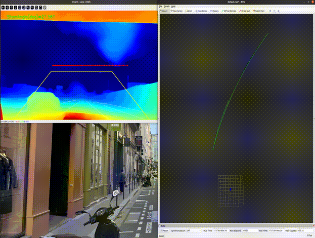
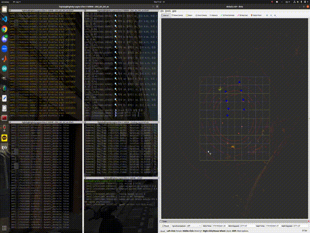

# My Project Work Workspace (ROS)

[](https://github.com/Highsky7/My_project_work_ws/issues) [](https://github.com/Highsky7/My_project_work_ws/network) [](https://github.com/Highsky7/My_project_work_ws/stargazers)

This repository contains a collection of ROS (Robot Operating System) based projects focused on autonomous driving, computer vision, and sensor fusion. It includes algorithms for perceiving the environment using various sensors, generating driving paths, and determining control commands.

## 🎞️ Result Visualization

| Ekf Purepursuit Result | Lane Segment & ROS Path Result |
| :------------------------------: | :--------------------------: |
|   |  |
|  Implements lane keeping using EKF for polynomial coefficient smoothing and Pure Pursuit steering, featuring an activation toggle based on detection confidence. | An extension or alternative focusing on publishing the final smoothed lane path as a `nav_msgs/Path` message. |
| Experimental Pseudo Lidar Result | Judgement Package Result |
|  |  |
| Integrates IPM (BEV) based lane detection with MiDaS depth estimation to generate a 3D path and corresponding steering angle. | Return the steering angle and boolean dynamic obstacle message to make car steer or stop according to the environment |

## 🚀 Packages Overview

This workspace is organized into the following main ROS packages:

1.  **`camera_lane_segmentation` (⭐ Main Focus)**
    * **Goal:** To robustly **detect lane lines** from monocular camera images, **generate a navigable path**, and calculate the **steering control angle** using the Pure Pursuit algorithm.
    * **Core Technologies:** YOLOPv2 (Deep Learning based Lane Segmentation), OpenCV (Image Processing), PyTorch, ROS.
    * **Key Features:** Birds-Eye View (BEV) transformation, various image filtering techniques (morphology, connected components, line fitting, CLAHE), thinning, (Extended) Kalman Filter (EKF) based lane modeling and path smoothing, includes an experimental Pseudo-LiDAR approach using MiDaS.

2.  **`judgement`**
    * **Goal:** To **integrate steering angle and path information** from multiple driving modes (e.g., `camera_lane_segmentation`, `tunnel_path`) and determine the most appropriate **final control command** based on the current situation.
    * **Core Technologies:** ROS topic subscription/publishing, state-based decision logic.
    * **Key Features:** Checking lane detection status, selecting steering angle based on priority, publishing unified path messages.
    * 

3.  **`wall_detection(incomplete)`**
    * **Goal:** To **detect surrounding walls** using LiDAR point cloud data.
    * **Core Technologies:** PCL (Point Cloud Library), RANSAC plane segmentation.
    * **Key Features:** Filtering points within specific distance/area ranges, detecting vertical planes (walls).

4.  **`tunnel_path(incomplete)`**
    * **Goal:** To **recognize tunnel environments** based on LiDAR scan data, generate a **central path** within the tunnel, and **calculate the steering angle**.
    * **Core Technologies:** LaserScan data processing, Pure Pursuit.
    * **Key Features:** Analyzing left/right distances from LiDAR, detecting tunnel entry, dynamic path generation, and steering control.

---

## ⭐ `camera_lane_segmentation` Details

This package is the core focus of the repository, emphasizing camera-based lane detection and driving control techniques.

### Goal

* Reliably detect lane lines from camera images under various lighting and road conditions.
* Generate a drivable path based on the detected lanes for the vehicle to follow.
* Calculate and publish the appropriate steering angle using the Pure Pursuit control algorithm based on the generated path.

### Core Technologies

* **Lane Segmentation:** Utilizes the YOLOPv2 deep learning model for pixel-wise segmentation of lane areas.
* **Computer Vision:** Leverages the OpenCV library for image pre-processing (CLAHE), post-processing (morphological operations, connected components analysis, thinning), BEV transformation, etc.
* **Sensor Fusion Concept:** Includes an experimental feature to generate Pseudo-LiDAR data from camera images using the MiDaS depth estimation model for 3D path estimation (`pseudo_lidar_IPM_bev.py`).
* **State Estimation:** Applies an (Extended) Kalman Filter to robustly estimate the parameters of a quadratic lane model and smooth the path from noisy lane detections.
* **Path Tracking:** Implements the Pure Pursuit algorithm to calculate the necessary steering angle to follow the estimated path.
* **Robot Operating System (ROS):** Built upon ROS for node communication (topic publishing/subscription) and overall system integration.

### Key Features & Script Details

#### Main Executable Scripts (`scripts/`)

* `Ekfsmooth_pure_pursuit_onoff.py`: Implements lane keeping using EKF for polynomial coefficient smoothing and Pure Pursuit steering, featuring an activation toggle based on detection confidence.
* `bev_with_superior_filtering_withoutdelay.py`: Similar to the above, but optimized to minimize processing delay.
* `lane_judge_path.py`: An extension or alternative focusing on publishing the final smoothed lane path as a `nav_msgs/Path` message.
* `ll_and_da.py`: Combines Lane Line (LL) detection and Drivable Area (DA) segmentation outputs from the YOLOPv2 model.
* `pseudo_lidar_IPM_bev.py`: Integrates IPM (BEV) based lane detection with MiDaS depth estimation to generate a 3D path and corresponding steering angle.

#### Utility Scripts (`scripts/utils/`)

* `__init__.py`: Standard Python file to make the `utils` directory recognizable as a package.
* `bev_utils.py`: Interactive tool using mouse clicks to define corresponding points between source image and target BEV plane, calculating and saving the perspective transformation matrix (`bev_params.npz`).
* `camera_calibration.py`: Contains functions or a script to perform camera calibration using chessboard patterns, finding intrinsic parameters and distortion coefficients.
* `check_opencv.py`: Simple utility to check the installed OpenCV version and available modules.
* `gpu_ckeck.py` (Likely typo for `gpu_check.py`): Checks for GPU availability and verifies PyTorch CUDA setup.
* `midas_depth.py`: Utility functions specifically for loading and running the MiDaS depth estimation model.
* `ros_interpreter.py`: Helper functions to convert between ROS message types (e.g., `sensor_msgs/Image`) and common Python data types (e.g., NumPy arrays).
* `util.py`: A collection of general utility functions (potentially math operations, color space conversions, etc.) used across different scripts.
* `utils.py`: A primary module containing core utility functions for the package, including image processing (masking, filtering, polynomial fitting, thinning), visualization helpers, and potentially YOLOPv2 inference wrappers.
* `vid_compression.txt`: A text file, likely containing notes or commands related to video compression (e.g., using ffmpeg).

### Published Topics

* `camera_lane_segmentation/lane_mask` (sensor_msgs/Image): Final processed lane mask (mono8).
* `auto_steer_angle_lane` (std_msgs/Float32): Calculated steering angle (degrees).
* `lane_detection_status` (std_msgs/Bool): Boolean status indicating whether lanes are currently detected.
* `lane_path` (nav_msgs/Path): Generated driving path relative to the vehicle's coordinate frame.

---

## 🛠️ Setup & Usage

### 1. Dependencies

* **ROS:** Melodic or Noetic recommended.
* **PyTorch:** CUDA-enabled version recommended ([https://pytorch.org/](https://pytorch.org/)).
* **OpenCV (cv2):** Python bindings (`pip install opencv-python opencv-contrib-python`).
* **NumPy:** (`pip install numpy`).
* **Other Python Packages:** `rospy`, `std_msgs`, `sensor_msgs`, `nav_msgs`, `geometry_msgs`, `tf` (usually included with ROS installation), `matplotlib` (for debugging/visualization).
* **MiDaS related:** `timm` (`pip install timm`).

### 2. Build

Navigate to the root directory of your ROS workspace (`My_project_work_ws`) and run the following commands:

```bash
cd ~/My_project_work_ws # Navigate to your workspace directory
catkin_make
# Or alternatively: catkin build
source devel/setup.bash
```
---

## 🏃‍♂ Run
### 1. (If needed) Run the BEV parameter setup utility first:
```bash
rosrun camera_lane_segmentation bev_utils.py --source 0 --out ~/My_project_work_ws/bev_params.npz
```
### 2. Run the main lane judgment node (using webcam device 0):
#### Replace paths with your actual parameter and weights file locations
```bash
rosrun camera_lane_segmentation lane_judge.py --source 0 --param-file ~/My_project_work_ws/bev_params.npz --weights ~/yolopv2.pt
```
### 3. Running the decision making node:
```bash
rosrun judgement judgement.py
```
### 4. Running the tunnel path generation node(incomplete)
```bash
rosrun tunnel_path tunnel_path_follower.py
```

---

## 👤 Contributor

* **Highsky7** ([https://github.com/Highsky7](https://github.com/Highsky7))

---

## 📄 License

Copyright (c) 2025 Highsky7. All rights reserved.
